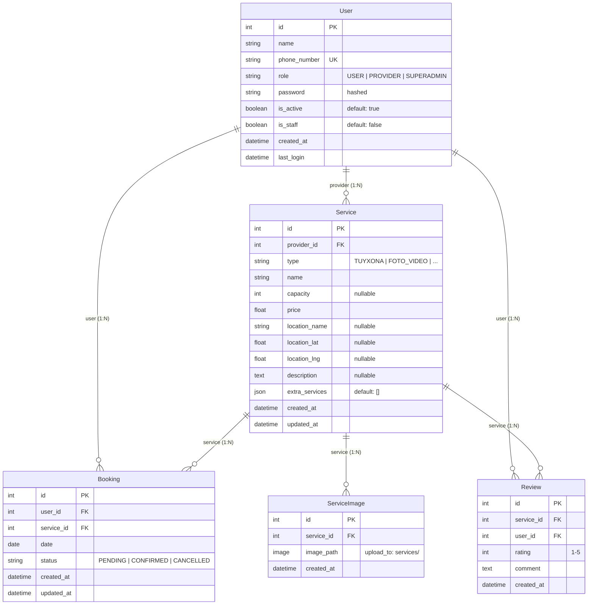
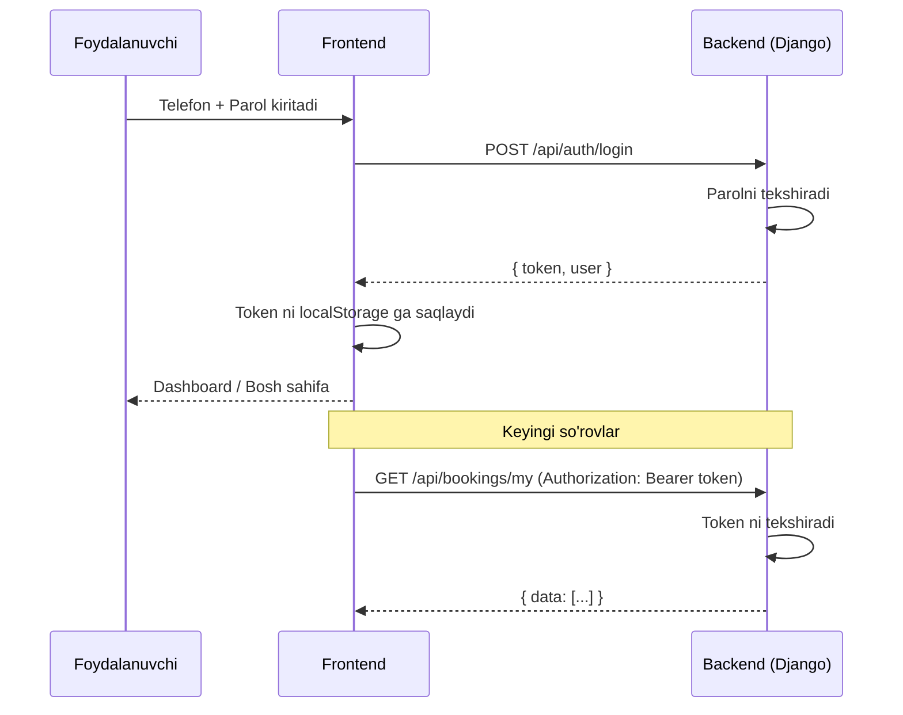

# 📋 TO'Y TANTANA — TEXNIK TOPSHIRIQ (Technical Specification)

**Loyiha nomi:** To'y Tantana — O'zbekistondagi to'y va marosim xizmatlari platformasi  
**Versiya:** 1.0.0  
**Sana:** 2026-yil, 11-iyul  
**Muallif:** CUBO kompaniyasi  
**Holati:** ✅ Web versiya tayyor | 📱 Mobil versiya — ishlanmoqda  

---

## 📑 Mundarija

1. [Loyiha haqida umumiy ma'lumot](#1-loyiha-haqida-umumiy-malumot)
2. [Texnologiyalar steki (Tech Stack)](#2-texnologiyalar-steki)
3. [Loyiha papkalar tuzilishi](#3-loyiha-papkalar-tuzilishi)
4. [Ma'lumotlar bazasi arxitekturasi](#4-malumotlar-bazasi-arxitekturasi)
5. [Foydalanuvchi rollari va huquqlari](#5-foydalanuvchi-rollari-va-huquqlari)
6. [Backend — API endpointlar ro'yxati](#6-backend-api-endpointlar-royxati)
7. [Frontend — Sahifalar va marshrutlar](#7-frontend-sahifalar-va-marshrutlar)
8. [Frontend — Komponentlar](#8-frontend-komponentlar)
9. [Frontend — Kontekstlar (State Management)](#9-frontend-kontekstlar)
10. [Frontend — API Client](#10-frontend-api-client)
11. [Lokalizatsiya (Ko'p tillilik)](#11-lokalizatsiya)
12. [Xizmat turlari](#12-xizmat-turlari)
13. [Viloyat va tumanlar ma'lumotnomasi](#13-viloyat-va-tumanlar)
14. [Dizayn tizimlari va uslublar](#14-dizayn-tizimlari)
15. [Autentifikatsiya va xavfsizlik](#15-autentifikatsiya-va-xavfsizlik)
16. [Server konfiguratsiyasi](#16-server-konfiguratsiyasi)
17. [Mobil dastur uchun yo'riqnoma](#17-mobil-dastur-uchun-yoriqnoma)
18. [Ishga tushirish bo'yicha qo'llanma](#18-ishga-tushirish-boyicha-qollanma)

---

## 1. Loyiha haqida umumiy ma'lumot

**To'y Tantana** — O'zbekiston bo'ylab to'y va marosim xizmatlarini (to'yxonalar, xonandalar, foto/video, to'y salonlari, kortej, tashkilotchilar) bir joyda **izlash, ko'rish va bron qilish** imkonini beruvchi onlayn platforma.

### Platformaning asosiy vazifalari:
- **Mijozlar** o'zlariga kerakli xizmatni viloyat, narx, tur bo'yicha izlab topadi va bo'sh kunlarni ko'rib bron qiladi
- **Xizmat ko'rsatuvchilar** o'z xizmatlarini ro'yxatga qo'yadi, rasmlar yuklaydi, bronlarni tasdiqlaydi/bekor qiladi, kunlarni band qiladi
- **Super Admin** butun platformani boshqaradi: statistika, analitika, foydalanuvchilar, xizmatlar va bronlar ustidan to'liq nazorat

### Loyihaning joriy holati:
| Qism | Holati | Texnologiya |
|------|--------|-------------|
| Backend (API) | ✅ Tayyor | Django 6.0 + DRF + PostgreSQL |
| Frontend (Web) | ✅ Tayyor | Next.js 16 + React 19 + Tailwind CSS |
| Mobil dastur (Android) | 📱 Rejalashtirilgan | React Native (Expo) |
| Deploy (Production) | 🔜 Rejalashtirilgan | — |

---

## 2. Texnologiyalar steki

### Backend
| Texnologiya | Versiya | Maqsadi |
|------------|---------|---------|
| Python | 3.14.5 | Asosiy dasturlash tili |
| Django | 6.0.6 | Backend framework |
| Django REST Framework | 3.17.1 | REST API yaratish |
| SimpleJWT | 5.5.1 | JWT token autentifikatsiya |
| django-cors-headers | 4.9.0 | CORS boshqaruvi |
| django-filter | 25.2 | API filtrlash |
| PostgreSQL | — | Ma'lumotlar bazasi |
| psycopg2-binary | 2.9.12 | PostgreSQL drayveri |
| Pillow | 12.3.0 | Rasm yuklash va qayta ishlash |

### Frontend
| Texnologiya | Versiya | Maqsadi |
|------------|---------|---------|
| Next.js | 16.2.6 | React framework (SSR + Routing) |
| React | 19.2.4 | UI kutubxonasi |
| Tailwind CSS | 4.x | Stilizatsiya tizimi |
| Phosphor Icons | 2.1.10 | Ikonkalar kutubxonasi |
| Leaflet + react-leaflet | 1.9.4 / 5.0.0 | Xarita ko'rsatish |
| Recharts | 3.9.2 | Admin analitika grafiklar |
| jsPDF + autotable | 4.2.1 / 5.0.8 | PDF eksport |
| xlsx | 0.18.5 | Excel eksport |
| html-to-image | 1.11.13 | Dashboard screenshot |

---

## 3. Loyiha papkalar tuzilishi

```
tuy-tantana/                          ← Loyiha ildizi
├── .env                              ← Environment o'zgaruvchilari (legacy)
├── .gitignore
├── uploads/                          ← Yuklangan rasmlar papkasi
│   └── services/                     ← Xizmat rasmlari
│
├── django_backend/                   ← Backend (Django)
│   ├── config/                       ← Django konfiguratsiya
│   │   ├── settings.py               ← Asosiy sozlamalar
│   │   ├── urls.py                   ← Asosiy URL routing
│   │   ├── wsgi.py
│   │   └── asgi.py
│   ├── accounts/                     ← Foydalanuvchilar ilovasi
│   │   ├── models.py                 ← User modeli
│   │   ├── serializers.py            ← UserSerializer, RegisterSerializer
│   │   ├── views.py                  ← Register, Login, Me
│   │   ├── admin_api.py              ← Admin API endpointlar
│   │   ├── admin.py                  ← Django admin registratsiya
│   │   └── urls.py
│   ├── services/                     ← Xizmatlar ilovasi
│   │   ├── models.py                 ← Service, ServiceImage, Review
│   │   ├── serializers.py            ← ServiceSerializer va boshqalar
│   │   ├── views.py                  ← ServiceViewSet, Upload
│   │   ├── admin.py
│   │   └── urls.py
│   ├── bookings/                     ← Bronlar ilovasi
│   │   ├── models.py                 ← Booking modeli
│   │   ├── serializers.py            ← BookingSerializer
│   │   ├── views.py                  ← BookingViewSet + block/unblock
│   │   ├── admin.py
│   │   └── urls.py
│   ├── venv/                         ← Python virtual muhit
│   └── manage.py
│
└── frontend/                         ← Frontend (Next.js)
    ├── app/                          ← Sahifalar (App Router)
    │   ├── layout.js                 ← Root layout + providerlar
    │   ├── page.js                   ← Bosh sahifa
    │   ├── globals.css               ← Global uslublar
    │   ├── error.js                  ← 500 xatolik sahifasi
    │   ├── not-found.js              ← 404 sahifasi
    │   ├── about/page.js             ← Loyiha haqida
    │   ├── contact/page.js           ← Aloqa
    │   ├── my-bookings/page.js       ← Mijoz bronlari
    │   ├── services/[id]/page.js     ← Xizmat batafsil
    │   ├── dashboard/                ← Xizmat ko'rsatuvchi paneli
    │   │   ├── layout.js             ← Sidebar layout
    │   │   ├── page.js               ← Dashboard
    │   │   ├── services/page.js      ← Xizmatlarni boshqarish
    │   │   └── profile/page.js       ← Profil
    │   └── admin/page.js             ← Super Admin panel
    ├── components/                   ← Qayta foydalaniladigan komponentlar
    │   ├── Header.jsx
    │   ├── AuthModal.jsx
    │   ├── HeroCarousel.jsx
    │   ├── FilterSidebar.jsx
    │   ├── ServiceCard.jsx
    │   ├── ServiceTabs.jsx
    │   ├── Footer.jsx
    │   ├── Toast.jsx
    │   ├── LocationPicker.jsx
    │   └── MapView.jsx
    ├── context/                      ← React kontekstlar
    │   ├── AuthContext.jsx
    │   └── LanguageContext.js
    ├── lib/                          ← Yordamchi kutubxonalar
    │   ├── api.js                    ← API client
    │   └── regions.js                ← Viloyat/tuman ma'lumotnomasi
    ├── locales/                      ← Tarjima fayllari
    │   ├── uz.json                   ← O'zbek tili (asosiy)
    │   ├── ru.json                   ← Rus tili
    │   ├── en.json                   ← Ingliz tili
    │   └── kaa.json                  ← Qoraqalpoq tili
    ├── public/                       ← Statik fayllar
    │   └── logo.png                  ← Sayt logotipi (favicon)
    ├── package.json
    ├── next.config.mjs
    └── postcss.config.mjs
```

---

## 4. Ma'lumotlar bazasi arxitekturasi

### 4.1 Entity Relationship Diagram (ER Diagram)



### 4.2 Modellar batafsil tavsifi

#### `User` — Foydalanuvchi modeli
> Django `AbstractBaseUser` + `PermissionsMixin` dan meros olgan maxsus foydalanuvchi modeli

| Maydon | Turi | Cheklovlar | Izoh |
|--------|------|-----------|------|
| `id` | AutoField | PK, auto-increment | Avtomatik |
| `name` | CharField(255) | majburiy | To'liq ism |
| `phone_number` | CharField(20) | **unique**, USERNAME_FIELD | Telefon raqam (login uchun) |
| `role` | CharField(20) | choices: USER/PROVIDER/SUPERADMIN, default=USER | Foydalanuvchi roli |
| `password` | (inherited) | hashed | Shifrlangan parol |
| `is_active` | BooleanField | default=True | Faollik holati |
| `is_staff` | BooleanField | default=False | Django admin huquqi |
| `created_at` | DateTimeField | auto_now_add | Ro'yxatdan o'tgan vaqti |

#### `Service` — Xizmat modeli

| Maydon | Turi | Cheklovlar | Izoh |
|--------|------|-----------|------|
| `id` | AutoField | PK | Avtomatik |
| `provider` | ForeignKey → User | CASCADE, related_name='services' | Xizmat egasi |
| `type` | CharField(20) | choices: 6 ta tur | Xizmat turi |
| `name` | CharField(255) | majburiy | Xizmat nomi |
| `capacity` | IntegerField | nullable | Sig'imi (faqat tuyxona) |
| `price` | FloatField | majburiy | Narxi (so'mda) |
| `location_name` | CharField(255) | nullable | Joylashuv nomi |
| `location_lat` | FloatField | nullable | Kenglik (latitude) |
| `location_lng` | FloatField | nullable | Uzunlik (longitude) |
| `description` | TextField | nullable | Tavsif |
| `extra_services` | JSONField | default=[] | Qo'shimcha xizmatlar ro'yxati |
| `created_at` | DateTimeField | auto_now_add | Yaratilgan vaqti |
| `updated_at` | DateTimeField | auto_now | Yangilangan vaqti |

#### `ServiceImage` — Xizmat rasmi

| Maydon | Turi | Cheklovlar | Izoh |
|--------|------|-----------|------|
| `id` | AutoField | PK | Avtomatik |
| `service` | ForeignKey → Service | CASCADE, related_name='images' | Tegishli xizmat |
| `image_path` | ImageField | upload_to='services/' | Rasm fayli |
| `created_at` | DateTimeField | auto_now_add | Yuklangan vaqti |

#### `Review` — Izoh/Sharh modeli

| Maydon | Turi | Cheklovlar | Izoh |
|--------|------|-----------|------|
| `id` | AutoField | PK | Avtomatik |
| `service` | ForeignKey → Service | CASCADE, related_name='reviews' | Tegishli xizmat |
| `user` | ForeignKey → User | CASCADE, related_name='reviews' | Izoh muallifi |
| `rating` | IntegerField | choices: 1-5 | Baho (yulduz) |
| `comment` | TextField | majburiy | Izoh matni |
| `created_at` | DateTimeField | auto_now_add | Yozilgan vaqti |

#### `Booking` — Bron modeli

| Maydon | Turi | Cheklovlar | Izoh |
|--------|------|-----------|------|
| `id` | AutoField | PK | Avtomatik |
| `user` | ForeignKey → User | CASCADE, related_name='bookings' | Bron qilgan foydalanuvchi |
| `service` | ForeignKey → Service | CASCADE, related_name='bookings' | Bron qilingan xizmat |
| `date` | DateField | majburiy | Bron sanasi |
| `status` | CharField(20) | choices: PENDING/CONFIRMED/CANCELLED, default=PENDING | Bron holati |
| `created_at` | DateTimeField | auto_now_add | Yaratilgan vaqti |
| `updated_at` | DateTimeField | auto_now | Yangilangan vaqti |

> [!IMPORTANT]
> **Unique Constraint:** Bitta xizmat uchun bitta sanada faqat **bitta** bron bo'lishi mumkin (`UniqueConstraint(fields=['service', 'date'])`).
> Agar oldingi bron `CANCELLED` holatida bo'lsa, qayta bron qilishda yangi yozuv yaratilmaydi, balki mavjud yozuv `PENDING` holatiga qaytariladi.

---

## 5. Foydalanuvchi rollari va huquqlari

### Rollar

| Rol | Tavsifi |
|-----|---------|
| `USER` | Oddiy mijoz — xizmatlarni ko'radi, bron qiladi, izoh yozadi |
| `PROVIDER` | Xizmat ko'rsatuvchi — xizmatlarini boshqaradi, bronlarni tasdiqlaydi |
| `SUPERADMIN` | Super administrator — butun platformani boshqaradi |

### Huquqlar matritsasi

| Funksiya | Anonim | USER | PROVIDER | SUPERADMIN |
|----------|--------|------|----------|------------|
| Bosh sahifa, xizmatlarni ko'rish | ✅ | ✅ | ✅ | ✅ |
| Xizmat batafsil ko'rish | ✅ | ✅ | ✅ | ✅ |
| Loyiha haqida, Aloqa sahifalari | ✅ | ✅ | ✅ | ✅ |
| Ro'yxatdan o'tish / Kirish | ✅ | — | — | — |
| Bron qilish | ❌ | ✅ | ❌* | ❌ |
| Izoh yozish | ❌ | ✅ | ✅ | ✅ |
| Mening bronlarim (`/my-bookings`) | ❌ | ✅ | ❌ | ❌ |
| Dashboard (`/dashboard`) | ❌ | ❌ | ✅ | ❌ |
| Xizmat qo'shish/o'chirish | ❌ | ❌ | ✅ | ✅ |
| Bron tasdiqlash/bekor qilish | ❌ | ❌ | ✅ | ✅ |
| Kunlarni band/ochish | ❌ | ❌ | ✅ | ❌ |
| Admin panel (`/admin`) | ❌ | ❌ | ❌ | ✅ |
| Statistika va Analitika | ❌ | ❌ | ❌ | ✅ |
| Excel/PDF eksport | ❌ | ❌ | ❌ | ✅ |

> *PROVIDER o'zining shaxsiy xizmatini bron qila olmaydi (himoya mavjud)

---

## 6. Backend — API endpointlar ro'yxati

### 6.1 Autentifikatsiya (`/api/auth/`)

#### `POST /api/auth/register` — Ro'yxatdan o'tish
- **Autentifikatsiya:** Kerak emas
- **Request body:**
```json
{
  "name": "Iskandarov Tursunpulat",
  "phone_number": "998973173497",
  "password": "parol123",
  "role": "USER"           // ixtiyoriy, default: "USER"
}
```
- **Response (201):**
```json
{
  "success": true,
  "message": "Muvaffaqiyatli ro'yxatdan o'tdingiz!",
  "data": {
    "token": "eyJhbG...",
    "user": { "id": 1, "name": "...", "phone_number": "...", "role": "USER", "created_at": "..." }
  }
}
```
- **Xatolik (400):** Telefon raqam allaqachon ro'yxatdan o'tgan

---

#### `POST /api/auth/login` — Kirish
- **Autentifikatsiya:** Kerak emas
- **Request body:**
```json
{
  "phone_number": "998973173497",
  "password": "parol123"
}
```
- **Response (200):**
```json
{
  "success": true,
  "message": "Muvaffaqiyatli kirdingiz",
  "data": {
    "token": "eyJhbG...",
    "user": { "id": 1, "name": "...", "phone_number": "...", "role": "USER", "created_at": "..." }
  }
}
```
- **Xatolik (400):** Telefon raqam yoki parol noto'g'ri

---

#### `GET /api/auth/me` — Joriy foydalanuvchi ma'lumoti
- **Autentifikatsiya:** `Bearer <token>` — majburiy
- **Response:**
```json
{
  "success": true,
  "data": { "id": 1, "name": "...", "phone_number": "...", "role": "USER", "created_at": "..." }
}
```

---

### 6.2 Xizmatlar (`/api/services/`)

#### `GET /api/services` — Xizmatlar ro'yxati
- **Autentifikatsiya:** Kerak emas
- **Query parametrlar:**

| Parametr | Turi | Tavsifi |
|----------|------|---------|
| `type` | string | Xizmat turini filtrlash (TUYXONA, FOTO_VIDEO, ...) |
| `provider` | int | Egasi ID bo'yicha |
| `search` | string | Nom bo'yicha qidiruv (icontains) |
| `price_min` | float | Minimal narx |
| `price_max` | float | Maksimal narx |
| `rating_min` | float | Minimal reyting |
| `location` | string | Joylashuv bo'yicha qidiruv |
| `date` | string (YYYY-MM-DD) | Bo'sh sanaga ega xizmatlarni filtrlash |
| `limit` | int | Natijalar soni (karusel uchun) |

- **Response:** Har bir xizmatda: `images[]`, `provider{}`, `bookings[]` (bekor qilinmaganlari), `average_rating`, `reviews_count`, `reviews[]`

---

#### `GET /api/services/{id}` — Xizmat batafsil
- **Autentifikatsiya:** Kerak emas
- **Response:** To'liq xizmat ob'ekti (barcha rasm, izoh, bron, reyting bilan)

---

#### `POST /api/services` — Yangi xizmat qo'shish
- **Autentifikatsiya:** `Bearer <token>` — majburiy
- **Request body:**
```json
{
  "type": "TUYXONA",
  "name": "Navruz tuyxonasi",
  "price": 15000000,
  "capacity": 300,
  "location_name": "Toshkent shahri, Yunusobod tumani",
  "location_lat": 41.3123,
  "location_lng": 69.2787,
  "description": "Zamonaviy to'yxona...",
  "extra_services": ["Ovqat", "Bezash", "DJ"]
}
```
- **Provider:** Avtomatik ravishda token egasiga biriktiriladi

---

#### `PUT/PATCH /api/services/{id}` — Xizmatni yangilash
- **Autentifikatsiya:** `Bearer <token>` — faqat egasi yoki SUPERADMIN

#### `DELETE /api/services/{id}` — Xizmatni o'chirish
- **Autentifikatsiya:** `Bearer <token>` — faqat egasi yoki SUPERADMIN

---

#### `GET /api/services/my/list` — Mening xizmatlarim
- **Autentifikatsiya:** `Bearer <token>` — majburiy
- **Response:** Faqat token egasiga tegishli xizmatlar

---

#### `POST /api/services/{id}/add_review` — Izoh yozish
- **Autentifikatsiya:** `Bearer <token>` — majburiy
- **Request body:**
```json
{
  "rating": 5,
  "comment": "Juda ajoyib xizmat!"
}
```

---

### 6.3 Rasm yuklash (`/api/upload/`)

#### `POST /api/upload/{service_id}` — Rasmlar yuklash
- **Autentifikatsiya:** `Bearer <token>` — xizmat egasi
- **Content-Type:** `multipart/form-data`
- **Body:** `images` maydoni — bir nechta fayl (max 5 ta, har biri 5MB)

#### `DELETE /api/upload/{image_id}/delete` — Rasmni o'chirish
- **Autentifikatsiya:** `Bearer <token>` — xizmat egasi

---

### 6.4 Bronlar (`/api/bookings/`)

#### `POST /api/bookings` — Bron yaratish
- **Autentifikatsiya:** `Bearer <token>` — majburiy
- **Request body:**
```json
{
  "service_id": 5,
  "date": "2026-08-15"
}
```
- **Biznes logikasi:**
  - O'tgan sanani qabul qilmaydi
  - Xizmat egasi o'z xizmatini bron qila olmaydi
  - Agar shu sanada CANCELLED bron mavjud bo'lsa — uni qayta faollashtiradi (PENDING qiladi)
  - Agar shu sanada faol bron mavjud bo'lsa — 409 Conflict qaytaradi

---

#### `GET /api/bookings/my` — Mening bronlarim
- **Autentifikatsiya:** `Bearer <token>` — majburiy
- **Response:** Foydalanuvchining barcha bronlari + summary (jami, faol, umumiy summa)

#### `GET /api/bookings/provider` — Provayderga kelgan bronlar
- **Autentifikatsiya:** `Bearer <token>` — majburiy
- **Response:** Provayderning barcha xizmatlariga kelgan bronlar

#### `PUT /api/bookings/{id}/status` — Bron holatini yangilash
- **Autentifikatsiya:** `Bearer <token>` — xizmat egasi yoki SUPERADMIN
- **Request:** `{ "status": "CONFIRMED" | "CANCELLED" }`

#### `POST /api/bookings/block` — Sanani band qilish
- **Autentifikatsiya:** `Bearer <token>` — xizmat egasi
- **Request:** `{ "service_id": 5, "date": "2026-08-20" }`
- **Biznes logikasi:** CONFIRMED holatida bron yaratib, sanani bloklaydi

#### `POST /api/bookings/unblock` — Band sanani ochish
- **Autentifikatsiya:** `Bearer <token>` — xizmat egasi
- **Request:** `{ "service_id": 5, "date": "2026-08-20" }`
- **Biznes logikasi:** Shu sanadagi bronni o'chirib tashlaydi

---

### 6.5 Admin API (`/api/admin/`)

> [!CAUTION]
> Barcha admin endpointlar **faqat SUPERADMIN** roli uchun ruxsat berilgan

#### `GET /api/admin/dashboard` — Umumiy statistika
```json
{
  "success": true,
  "data": {
    "totalUsers": 25,
    "totalProviders": 8,
    "totalServices": 15,
    "totalBookings": 42,
    "pendingBookings": 12,
    "confirmedBookings": 25,
    "servicesByType": [
      { "type": "TUYXONA", "label": "To'yxona", "_count": { "id": 5 } }
    ]
  }
}
```

#### `GET /api/admin/analytics?timeframe=daily|monthly|yearly` — Analitika
- **Response:** Vaqt davri bo'yicha bronlar grafik ma'lumotlari, foydalanuvchilar o'sishi, top 5 xizmatlar, umumiy aylanma

#### `GET /api/admin/users` — Barcha foydalanuvchilar
#### `GET /api/admin/services` — Barcha xizmatlar
#### `GET /api/admin/bookings` — Barcha bronlar

---

## 7. Frontend — Sahifalar va marshrutlar

### 7.1 Umumiy sahifalar (Public)

#### `/` — Bosh sahifa
- **Komponentlar:** Header, HeroCarousel, ServiceTabs, FilterSidebar, ServiceCard, Footer
- **Funksionallik:**
  - 6 ta xizmat turi bo'yicha tablar
  - Qidiruv (ism bo'yicha)
  - Filtrlash: sana, narx diapazoni, viloyat/tuman, reyting
  - Xizmatlar grid (1/2/3 ustun, responsive)
  - Skeleton loading (6 ta karta)
  - Bo'sh natija holati ("Xizmatlar topilmadi")
  - Mobil filtr paneli (overlay)

#### `/services/[id]` — Xizmat batafsil sahifasi
- **Komponentlar:** Header, Footer, MapView, BookingCalendar (inline), ReviewsSection (inline)
- **Funksionallik:**
  - Rasm galereyasi (auto-rotate, thumbnail navigation)
  - Xizmat nomi, joylashuv, sig'im, tavsif, qo'shimcha xizmatlar
  - Provayder ma'lumotlari (ism, telefon — click-to-call)
  - Leaflet xarita (agar koordinatalar mavjud)
  - **Bron kalendari:**
    - Oy bo'yicha navigatsiya
    - Bron qilingan kunlar: 🔴 Tasdiqlangan, 🟡 Kutilmoqda
    - O'tgan kunlar o'chirilgan
    - Tanlangan kun binafsha rangda
    - Foydalanuvchi tizimga kirishi shart
  - **Izohlar bo'limi:**
    - Barcha izohlar ro'yxati (yulduz + matn)
    - Yangi izoh formasidagi yulduz tanlash + matn kiritish
    - Faqat tizimga kirgan foydalanuvchilar yoza oladi

#### `/about` — Loyiha haqida
- Statik sahifa — loyiha haqida ma'lumot, afzalliklar ro'yxati

#### `/contact` — Aloqa
- Kontakt ma'lumotlar: Telefon, Telegram, Instagram, Email, Manzil

---

### 7.2 Mijoz sahifalari (USER)

#### `/my-bookings` — Mening bronlarim
- **Kirish:** Faqat USER roli
- **Funksionallik:**
  - 4 ta statistika kartochkasi: Jami, Tasdiqlangan (yashil), Kutilmoqda (sariq), Bekor qilingan (qizil)
  - Bronlar ro'yxati: xizmat rasmi, nomi, provayder, sana, narx, status badge
  - Pagination (10 ta/sahifa)

---

### 7.3 Xizmat ko'rsatuvchi paneli (PROVIDER)

#### `/dashboard` (Layout)
- Chap tomonda doimiy sidebar (264px): Logo, foydalanuvchi ismi, navigatsiya havolalari, chiqish tugmasi
- Navigatsiya: Dashboard, Xizmatlarim, Profil

#### `/dashboard` (Index) — Boshqaruv paneli
- **Funksionallik:**
  - 5 ta stat kartochka: Xizmatlar soni, Jami bronlar, Kutilmoqda, Tasdiqlangan, Bekor qilingan
  - Buyurtmalar jadvali: Mijoz (ism+telefon), Xizmat, Sana, Status, Harakatlar (Tasdiqlash/Bekor qilish tugmalari)
  - Pagination (10 ta/sahifa)
  - PENDING bronlarni bir bosishda CONFIRMED/CANCELLED qilish

#### `/dashboard/services` — Xizmatlarni boshqarish
- **Funksionallik:**
  - "Yangi xizmat qo'shish" formasi (toggle):
    - Xizmat turi (6 ta dropdown)
    - Nomi, Narxi (auto-formatlangan: 15 000 000), Sig'imi (faqat TUYXONA)
    - Viloyat/Tuman dropdownlari (dinamik)
    - Xaritadan joylashuvni belgilash (LocationPicker)
    - Tavsif, Qo'shimcha xizmatlar
    - Rasmlar yuklash (max 5, 5MB)
  - Xizmatlar grid (kartochkalar): Rasm, nom, tur, narx, bronlar soni, o'chirish tugmasi
  - Har bir xizmat uchun "Kunlarni boshqarish" (BlockCalendar):
    - Kalendar: band kunlar qizil, kutilayotgan sariq, bo'sh oq
    - Bosish → sanani band qilish
    - Band sanani bosish → bekor qilish modali
  - Pagination (10 ta/sahifa)

#### `/dashboard/profile` — Profil
- Foydalanuvchi ma'lumotlari: Avatar (birinchi harf), Ism, Telefon, Rol, Ro'yxatdan o'tgan sana
- Chiqish tugmasi

---

### 7.4 Super Admin paneli (SUPERADMIN)

#### `/admin` — Admin boshqaruv paneli
- **O'ziga xos header** (shared Header ishlatilmaydi)
- **5 ta tab:**

| Tab | Funksionallik |
|-----|--------------|
| 📊 Dashboard | Statistika kartochkalari (8+): foydalanuvchilar, provayderlar, xizmatlar, bronlar, kutilmoqda, tasdiqlangan, xizmat turlari bo'yicha. PDF eksport |
| 📈 Analitika | Vaqt oralig'i tanlash (kunlik/oylik/yillik). Bronlar grafigi (LineChart), Foydalanuvchilar o'sishi (BarChart), Top 5 xizmatlar (PieChart), Umumiy aylanma, Statistik ko'rsatkichlar (max/min/avg). PDF eksport |
| 👥 Foydalanuvchilar | Jadval: ID, Ism, Telefon, Rol, Xizmatlar soni, Bronlar soni, Ro'yxatdan o'tgan sana. Tartiblash (sort), Qidiruv, Rol filtri, Sana diapazoni. Excel + PDF eksport. Pagination |
| 🛠️ Xizmatlar | Jadval: ID, Nomi, Turi, Narxi, Egasi (ism+telefon), Bronlar soni. Tartiblash, Qidiruv, Tur filtri. Excel + PDF eksport. Pagination |
| 📅 Bronlar | Jadval: ID, Mijoz (ism+telefon), Xizmat, Sana, Narxi, Status (badge). Tartiblash, Qidiruv, Status filtri. Excel + PDF eksport. Pagination |

---

## 8. Frontend — Komponentlar

### 8.1 `Header.jsx` (309 qator)
- Doimiy yuqoridagi navigatsiya paneli (sticky top)
- Logo + Navigatsiya havolalari + Til tanlash + Auth bo'limi
- **Til tanlash:** 4 ta til (UZ, KAA, EN, RU) — bayroqcha ikonlari bilan dropdown
- **Auth:** Agar kirmagan → "Kirish" / "Ro'yxatdan o'tish" tugmalari (AuthModal ochadi). Agar kirgan → Foydalanuvchi nomi + dropdown menu (rol asosida marshrutlar)
- **Mobil:** Hamburger menu

### 8.2 `AuthModal.jsx` (294 qator)
- Full-screen modal overlay
- **Login rejimi:** Telefon (+998 prefix, 9 raqam), Parol
- **Register rejimi:** Ism, Telefon, Parol (min 6 belgi), Rol tanlash (USER/PROVIDER)
- Telefon raqam auto-formatlash (faqat raqamlar)
- Rejimlar o'rtasida almashtirish havola
- Body scroll qulflash

### 8.3 `HeroCarousel.jsx` (311 qator)
- API dan top 5 xizmatni oladi
- Auto-rotate (5 soniya, hover da to'xtaydi)
- Prev/Next strelkalar (hover da ko'rinadi)
- Nuqtali navigatsiya
- Xizmat turiga qarab gradient fon va ikonka
- Fallback rasmlar (Unsplash)
- Bo'sh holat: dekorativ hero sahifa (suzuvchi yulduzlar + CTA)

### 8.4 `FilterSidebar.jsx` (155 qator)
- **Filtrlar:** Sana, Narx diapazoni (min/max UZS), Viloyat dropdown, Tuman dropdown (viloyatga bog'liq), Reyting (1-5 yulduz)
- "Filtrlash" va "Tozalash" tugmalari

### 8.5 `ServiceCard.jsx` (132 qator)
- Xizmat kartochkasi: 4:3 rasm (tur asosida fallback), tur badge, nom, yulduz reyting, izoh soni, sig'im (TUYXONA), joylashuv, narx (UZS), "Batafsil" tugma
- Hover effektlar: scale, shadow, border rang, rasm zoom

### 8.6 `ServiceTabs.jsx` (45 qator)
- 6 ta xizmat turi tabi: Phosphor ikonlar bilan
- Gorizontal scroll (mobil), flex (desktop)
- Faol tab: binafsha highlight

### 8.7 `Footer.jsx` (78 qator)
- 3 ustunli footer: Logo+tavsif, Tezkor havolalar, Kontakt ma'lumotlari
- Copyright (dinamik yil)

### 8.8 `Toast.jsx` (58 qator)
- **API:** `toast.success(msg)`, `toast.error(msg)`, `toast.info(msg)`
- O'ng yuqori burchakda paydo bo'ladi, 4 soniyada yo'qoladi
- Rangli: yashil/qizil/ko'k + emoji

### 8.9 `LocationPicker.jsx` (69 qator)
- Leaflet xarita — bosish orqali marker qo'yish
- Default markaz: Toshkent (41.2995, 69.2401)
- Koordinatalarni ko'rsatadi

### 8.10 `MapView.jsx` (55 qator)
- Faqat ko'rish (read-only) Leaflet xarita
- Marker + popup (xizmat nomi)
- Scroll zoom o'chirilgan

---

## 9. Frontend — Kontekstlar

### 9.1 `AuthContext.jsx`
- **Provider:** `AuthProvider`
- **Hook:** `useAuth()`
- **State:** `user`, `token`, `loading`
- **Metodlar:** `login(phone, password)`, `register(data)`, `logout()`
- Token `localStorage` da saqlanadi
- Sahifa yangilaganda `getMe()` orqali sessiya tiklanadi

### 9.2 `LanguageContext.js`
- **Provider:** `LanguageProvider`
- **Hook:** `useLanguage()`
- **State:** `lang` (default: 'uz'), `isLoaded`
- **Metodlar:** `changeLang(lang)`, `t(key, params)`
- Til `localStorage` da saqlanadi (`site_lang` kalit)
- 4 ta til qo'llab-quvvatlanadi
- Parametrli interpolatsiya: `{name}`, `{count}`, `{year}`

---

## 10. Frontend — API Client

**Fayl:** `lib/api.js`  
**Base URL:** `http://localhost:8000/api`  
**Image Base URL:** `http://localhost:8000`

| Funksiya | Metod | Endpoint | Auth | Tavsif |
|----------|-------|----------|------|--------|
| `register(data)` | POST | `/auth/register` | ❌ | Ro'yxatdan o'tish |
| `login(data)` | POST | `/auth/login` | ❌ | Kirish |
| `getMe(token)` | GET | `/auth/me` | ✅ | Profil olish |
| `getServices(params)` | GET | `/services?...` | ❌ | Xizmatlar ro'yxati |
| `getServiceById(id)` | GET | `/services/{id}` | ❌ | Xizmat batafsil |
| `addReview(id, data, token)` | POST | `/services/{id}/add_review` | ✅ | Izoh yozish |
| `getMyServices(token)` | GET | `/services/my/list` | ✅ | Mening xizmatlarim |
| `createService(data, token)` | POST | `/services` | ✅ | Xizmat yaratish |
| `updateService(id, data, token)` | PUT | `/services/{id}` | ✅ | Xizmat yangilash |
| `deleteService(id, token)` | DELETE | `/services/{id}` | ✅ | Xizmat o'chirish |
| `uploadImages(serviceId, files, token)` | POST | `/upload/{id}` | ✅ | Rasm yuklash |
| `deleteImage(imageId, token)` | DELETE | `/upload/{id}` | ✅ | Rasm o'chirish |
| `createBooking(data, token)` | POST | `/bookings` | ✅ | Bron yaratish |
| `getMyBookings(token)` | GET | `/bookings/my` | ✅ | Mening bronlarim |
| `getProviderBookings(token)` | GET | `/bookings/provider` | ✅ | Provayderga bronlar |
| `blockDate(data, token)` | POST | `/bookings/block` | ✅ | Sanani band qilish |
| `unblockDate(data, token)` | POST | `/bookings/unblock` | ✅ | Bandni ochish |
| `updateBookingStatus(id, s, token)` | PUT | `/bookings/{id}/status` | ✅ | Status yangilash |
| `adminDashboard(token)` | GET | `/admin/dashboard` | ✅ | Admin statistika |
| `adminAnalytics(token, tf)` | GET | `/admin/analytics?...` | ✅ | Admin analitika |
| `adminUsers(token)` | GET | `/admin/users` | ✅ | Barcha foydalanuvchilar |
| `adminServices(token)` | GET | `/admin/services` | ✅ | Barcha xizmatlar |
| `adminBookings(token)` | GET | `/admin/bookings` | ✅ | Barcha bronlar |

---

## 11. Lokalizatsiya

### Qo'llab-quvvatlanadigan tillar

| Kod | Til | Fayl | Hajmi |
|-----|-----|------|-------|
| `uz` | O'zbek tili (asosiy) | `locales/uz.json` | 182 kalit |
| `kaa` | Qoraqalpoq tili | `locales/kaa.json` | 182 kalit |
| `en` | Ingliz tili | `locales/en.json` | 181 kalit |
| `ru` | Rus tili | `locales/ru.json` | 182 kalit |

### Tarjima kalitlari kategoriyalari (~180 ta)
- `nav_*` — Navigatsiya
- `footer_*` — Footer
- `hero_slide*` — Karusel slaydlar
- `service_*` — Xizmat turlari
- `filter_*` — Filtrlar
- `login_*`, `register_*` — Avtorizatsiya
- `book_now`, `booking_*` — Bron qilish
- `customer_reviews`, `leave_comment_*` — Izohlar
- `sidebar_*`, `dashboard_*` — Dashboard
- `about_*` — Loyiha haqida
- `contact_*` — Aloqa
- `status_*` — Holat nomlari
- `day_mo` ... `day_su` — Hafta kunlari

> [!NOTE]
> Admin paneli, Dashboard profil, Dashboard xizmatlar formasi va xatolik sahifalari hozircha lokalizatsiya qilinmagan (faqat O'zbek tilida hardcoded).

---

## 12. Xizmat turlari

| Kalit | O'zbek nomi | Ingliz nomi | Tavsif |
|-------|-------------|-------------|--------|
| `TUYXONA` | To'yxona | Wedding Venue | To'y marosimi o'tkaziladigan joy |
| `FOTO_VIDEO` | Foto va Video | Photo & Video | Professional suratga olish va video |
| `XONANDA` | Xonanda | Singer/Artist | Jonli ijro va dastur boshlovchi |
| `SALON` | To'y salon | Beauty Salon | Kelin-kuyov uchun go'zallik xizmatlari |
| `KORTEJ` | Kortej | Car Cortege | To'y mashinalar karvoni |
| `TASHKILOTCHI` | Tashkilotchi | Event Organizer | To'y tashkilotchisi xizmatlari |

> **Eslatma:** `capacity` (sig'im) maydoni faqat `TUYXONA` turi uchun ko'rsatiladi va kiritiladi.

---

## 13. Viloyat va tumanlar

Tizimda O'zbekistonning **14 ta viloyat/respublika** va ulardagi **~196 ta tuman/shahar** ro'yxati mavjud:

| # | Viloyat/Respublika | Tumanlar soni |
|---|-------------------|--------------|
| 1 | Toshkent shahri | 12 |
| 2 | Toshkent viloyati | 20 |
| 3 | Andijon viloyati | 16 |
| 4 | Buxoro viloyati | 13 |
| 5 | Farg'ona viloyati | 18 |
| 6 | Jizzax viloyati | 13 |
| 7 | Xorazm viloyati | 12 |
| 8 | Namangan viloyati | 12 |
| 9 | Navoiy viloyati | 10 |
| 10 | Qashqadaryo viloyati | 14 |
| 11 | Samarqand viloyati | 15 |
| 12 | Sirdaryo viloyati | 11 |
| 13 | Surxondaryo viloyati | 14 |
| 14 | Qoraqalpog'iston Respublikasi | 16 |

Bu ma'lumotlar `lib/regions.js` faylida saqlanadi va FilterSidebar hamda AddServiceForm komponentlarida ishlatiladi.

---

## 14. Dizayn tizimlari va uslublar

### Ranglar palitras

| Rang | Hex kodi | Ishlatilishi |
|------|----------|-------------|
| Primary (binafsha) | `#7C3AED` | Tugmalar, faol elementlar, accent |
| Primary Dark | `#6D28D9` | Gradient ikkinchi rang |
| Background | `#F8F7FF` | Sahifa foni (och lavanda) |
| Card Background | `#FFFFFF` | Kartochkalar foni |
| Input Background | `#F5F3FF` | Kiritish maydonlari foni |
| Text Primary | `#111827` (gray-900) | Asosiy matn |
| Text Secondary | `#6B7280` (gray-500) | Ikkinchi darajali matn |
| Success (yashil) | `#10B981` / green-500 | Tasdiqlangan holat |
| Warning (sariq) | `#F59E0B` / yellow-500 | Kutilmoqda holat |
| Danger (qizil) | `#EF4444` / red-500 | Bekor qilingan / xatolik |

### Tipografiya
- **Shrift:** Inter (Google Fonts) — Latin + Cyrillic
- **Font variable:** `--font-inter`

### Animatsiyalar
- `fadeIn` — elementlar paydo bo'lishi
- `slideUp` — pastdan yuqoriga siljish
- `slideDown` — yuqoridan pastga siljish
- `shimmer` — loading skeleton effekti
- `pulse-purple` — binafsha rangda pulsatsiya
- `stagger-children` — bolalar elementlari ketma-ket paydo bo'lishi (0.05s oraliq)

### UI komponent uslublari
- **Kartochkalar:** `rounded-2xl border border-gray-200 shadow-sm`
- **Tugmalar:** `rounded-xl gradient bg-gradient-to-r from-[#7C3AED] to-[#6D28D9] text-white`
- **Kiritish maydonlari:** `rounded-xl bg-gray-50 border border-gray-200 px-4 py-3`
- **Badge/Status:** `rounded-full text-xs px-2.5 py-1 font-medium`
- **Hover effektlar:** `hover:shadow-lg hover:shadow-[#7C3AED]/20 transition-all`

---

## 15. Autentifikatsiya va xavfsizlik

### JWT Token konfiguratsiyasi
| Parametr | Qiymat |
|----------|--------|
| Token turi | Bearer |
| Access token muddati | 7 kun |
| Refresh token muddati | 14 kun |
| Algoritmasi | HS256 (default) |
| Header formati | `Authorization: Bearer <token>` |

### Xavfsizlik eslatmalari

> [!WARNING]
> Quyidagi masalalar **production** ga chiqarishdan oldin hal qilinishi shart:
> - `SECRET_KEY` xavfsiz va yashirin qilinishi kerak (hozirda `django-insecure-...`)
> - `DEBUG = False` qilinishi kerak
> - `ALLOWED_HOSTS` to'g'ri sozlanishi kerak
> - `CORS_ALLOW_ALL_ORIGINS = True` ni aniq domenlar bilan almashtirish kerak
> - Ma'lumotlar bazasi paroli `.env` faylga ko'chirilishi kerak
> - HTTPS majburiy qilinishi kerak

### Autentifikatsiya oqimi (Flow)


---

## 16. Server konfiguratsiyasi

### Ma'lumotlar bazasi (PostgreSQL)
```
Host:     localhost
Port:     5432
Database: tuy_tantana
User:     postgres
Password: F3377274
```

### Media fayllar
- **URL:** `/uploads/`
- **Disk joylashuvi:** `<loyiha_ildizi>/uploads/services/`
- **Ruxsat etilgan formatlar:** JPEG, PNG, WebP
- **Maksimal hajm:** 5 MB (frontend tomonidan cheklanadi)

### Django server
- **Default port:** 8000
- **Buyruq:** `python manage.py runserver`

### Next.js server
- **Default port:** 3000
- **Buyruq:** `npm run dev`

### Dependencies (Python)
```
Django==6.0.6
djangorestframework==3.17.1
djangorestframework-simplejwt==5.5.1
django-cors-headers==4.9.0
django-filter==25.2
psycopg2-binary==2.9.12
Pillow==12.3.0
```

---

## 17. Mobil dastur uchun yo'riqnoma

### Tavsiya qilingan texnologiya
**React Native (Expo)** — Web saytimiz React (Next.js) da yozilgan, shuning uchun React Native orqali mobil dastur yasash eng mantiqiy va samarali yo'l.

### Backend bilan aloqa
Mobil dastur **xuddi shu API** endpointlardan foydalanadi. Hech qanday qo'shimcha backend yozish shart emas. Faqat `API_BASE` URL ni production server manziliga o'zgartirish kerak.

### Minimal ekranlar ro'yxati (Mobil dastur uchun)

| # | Ekran | Funksionallik | API endpointlar |
|---|-------|--------------|-----------------|
| 1 | Kirish/Ro'yxatdan o'tish | Telefon + parol, rol tanlash | `POST /auth/login`, `POST /auth/register` |
| 2 | Bosh ekran | Xizmat turlari + mashhur xizmatlar | `GET /services?type=...` |
| 3 | Xizmatlar ro'yxati | Filtrlash, qidiruv, ro'yxat | `GET /services?...` |
| 4 | Xizmat batafsil | Rasmlar, ma'lumotlar, xarita, izohlar | `GET /services/{id}` |
| 5 | Bron qilish | Kalendar + bron tugmasi | `POST /bookings` |
| 6 | Mening bronlarim | Bronlar ro'yxati, status | `GET /bookings/my` |
| 7 | Profil | Ism, telefon, chiqish | `GET /auth/me` |

### Dizayn bo'yicha tavsiyalar
- Web saytdagi ranglar palitrasini aynan takrorlang (#7C3AED primary)
- Inter shriftini ishlating
- Status ranglarini saqlang (yashil/sariq/qizil)
- Kartochkalar dizayni web versiyaga o'xshash bo'lsin

---

## 18. Ishga tushirish bo'yicha qo'llanma

### 1-qadam: PostgreSQL o'rnatish va baza yaratish
```sql
CREATE DATABASE tuy_tantana;
```

### 2-qadam: Backend (Django) ni ishga tushirish
```bash
cd tuy-tantana/django_backend
python -m venv venv
venv\Scripts\activate          # Windows
pip install django djangorestframework djangorestframework-simplejwt django-cors-headers django-filter psycopg2-binary Pillow
python manage.py migrate
python manage.py createsuperuser
python manage.py runserver
```

### 3-qadam: Frontend (Next.js) ni ishga tushirish
```bash
cd tuy-tantana/frontend
npm install
npm run dev
```

### 4-qadam: Tekshirish
- Backend: `http://localhost:8000/api/services`
- Frontend: `http://localhost:3000`
- Admin: Django admin `http://localhost:8000/admin/`

---

> [!TIP]
> Ushbu hujjat loyihaning to'liq texnik spetsifikatsiyasidir. Yangi dasturchi yoki dizayner bu hujjat orqali loyihani to'liq tushunishi va ishni davom ettirishi mumkin. Hujjat **2026-yil 11-iyul** holatiga muvofiq yangilangan.

---

**© 2026 CUBO kompaniyasi. Barcha huquqlar himoyalangan.**
